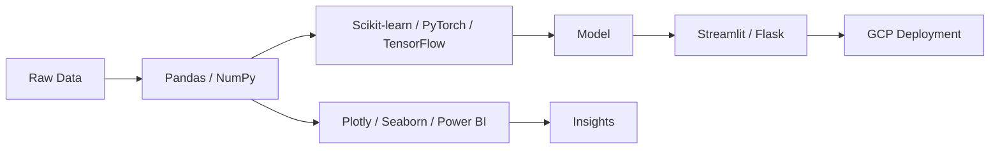

<picture>
  <source media="(prefers-color-scheme: dark)" srcset="https://raw.githubusercontent.com/Mister2005/Mister2005/main/assets/hero-dark.svg">
  <source media="(prefers-color-scheme: light)" srcset="https://raw.githubusercontent.com/Mister2005/Mister2005/main/assets/hero-light.svg">
  
</picture>

<p align="center"><b>AI & Data Science Enthusiast | Engineering Student | Curious Explorer</b></p>

[](https://linkedin.com/in/varun-gupta-220382290)
[](mailto:varunygupta123@gmail.com)
[](https://github.com/Mister2005)

---

## Model Card: `varun-gupta-2005`

| | |
|---|---|
| **Architecture** | Human · AI & Data Science Engineering student |
| **Params** | CGPA 8.71/10.0 |
| **Training window** | 2023 – 2027 |
| **Base institution** | Dwarkadas J Sanghvi College of Engineering, Mumbai |
| **License** | Open to internships, collaborations, and interesting problems |

### The code portrait

Every character below is copied, in order, from [`tools/gradient_descent.py`](tools/gradient_descent.py) — a real, runnable batch gradient descent implementation, not filler text. Each glyph is tinted with the actual pixel colour from a photo of me, so the code becomes the picture.

<picture>
  <source media="(prefers-color-scheme: dark)" srcset="https://raw.githubusercontent.com/Mister2005/Mister2005/main/assets/portrait-dark.svg">
  <source media="(prefers-color-scheme: light)" srcset="https://raw.githubusercontent.com/Mister2005/Mister2005/main/assets/portrait-light.svg">
  
</picture>

<details>
<summary>Plain-text ASCII version (no image dependency)</summary>

```
"""Aplainbatchgradientdescentfitforlinearregression.Thisisareal,runnableimplementation-notadecoration.Itssourcetextdoublesasthecha
racterstreamforthecode-portraitinassets/portrait-*.svg:everyglyphyouseeinthatportraitisacharactercopiedinorderfromthisfile,tintedw
iththephoto'sactualpixelcolours."""from__future__importannotationsimportrandomdefgenerate_data(n:int=200,true_w:float=2.5,true_b:f
loat=-1.0,noise:float=1.0):xs=[random.uniform(-10,10)for_inrange(n)]ys=[true_w*x+true_b+random.gauss(0,noise)forxinxs]returnxs,ysd
efpredict(w:float,b:float,x:float)->float:returnw*x+bdefmean_squared_error(w:float,b:float,xs:list[float],ys:list[float])->float:n
=len(xs)total=0.0forx,yinzip(xs,ys):error=predict(w,b,x)-ytotal+=error*errorreturntotal/ndefgradients(w:float,b:float,xs:list[floa
t],ys:list[float])->tuple[float,float]:n=len(xs)dw=0.0db=0.0forx,yinzip(xs,ys):error=predict(w,b,x)-ydw+=2*error*xdb+=2*errorretur
ndw/n,db/ndefgradient_descent(xs:list[float],ys:l-:.--::.....:...:=--:=01,epochs:int=500,w:float=0.0,b:float=0.0,):history=[]forep
ochinrange(epochs):dw,db=gradients(w,b,:.-::)w=:..     ...  .. .      ...:--ed_error(w,b,xs,ys)history.append(loss)ifepoch%50==0:p
rint(f"epoch{epoch:4d}loss{loss:.4f}w{-...:.:. .                         .   .:-:random.seed(2005)xs,ys=generate_data()w,b,history
=gradient_descent(xs,ys)print(f"\nfin-:.                                         .:history[-1]:.4f}")if__name__=="__main__":main()
"""Aplainbatchgradientdescentfitfor-..                                            ..=n-notadecoration.Itssourcetextdoublesasthecha
racterstreamforthecode-portraitinas=.                                              ..=sacharactercopiedinorderfromthisfile,tintedw
iththephoto'sactualpixelcolours.""":.                                              .:-ate_data(n:int=200,true_w:float=2.5,true_b:f
loat=-1.0,noise:float=1.0):xs=[ra-.                                               ..e_b+random.gauss(0,noise)forxinxs]returnxs,ysd
efpredict(w:float,b:float,x:flo=:                                                .:b:float,xs:list[float],ys:list[float])->float:n
=len(xs)total=0.0forx,yinzip(xs:                                                 :::tal/ndefgradients(w:float,b:float,xs:list[floa
t],ys:list[float])->tuple[float,-:.                                             ..::-predict(w,b,x)-ydw+=2*error*xdb+=2*errorretur
ndw/n,db/ndefgradient_descent(xs:l.                                        ......::-:-00,w:float=0.0,b:float=0.0,):history=[]forep
ochinrange(epochs):dw,db=gradients-                                     ...........::::b,xs,ys)history.append(loss)ifepoch%50==0:p
rint(f"epoch{epoch:4d}loss{loss:.4.                                                ..:::seed(2005)xs,ys=generate_data()w,b,history
=gradient_descent(xs,ys)print(f"\n.                                              ........y[-1]:.4f}")if__name__=="__main__":main()
"""Aplainbatchgradientdescentfitfo:                                           ..=ation. =tadecoration.Itssourcetextdoublesasthecha
racterstreamforthecode-portraitina-                               ..          .:----:..:c-ar=ctercopiedinorderfromthisfile,tintedw
iththephoto'sactualpixelcolours."":                                           ....    ..:==:.=(n:int=200,true_w:float=2.5,true_b:f
loat=-1.0,noise:float=1.0):xs=[ran.                                   .....             .:----.gauss(0,noise)forxinxs]returnxs,ysd
efpredict(w:float,b:float,x:float).                                           .           .--:list[float],ys:list[float])->float:n
=len(xs)total=0.0forx,yinzip(xs,ys)-                                                       :::adients(w:float,b:float,xs:list[floa
t],ys:list[float])->tuple[float,floa.                                                      :=w,b,x)-ydw+=2*error*xdb+=2*errorretur
ndw/n,db/ndefgradient_descent(xs:lis-                                           .      .. .float=0.0,b:float=0.0,):history=[]forep
ochinrange(epochs):dw,db=gradients(w=.                                          .      .: .,ys)history.append(loss)ifepoch%50==0:p
rint(f"epoch{epoch:4d}loss{loss:.4f}w{.                                                 ..ed(2005)xs,ys=generate_data()w,b,history
=gradient_descent(xs,ys)print(f"\nfinal.                                                .:[-1]:.4f}")if__name__=="__main__":main()
"""Aplainbatchgradientdescentfitforlinea.                                                .adecoration.Itssourcetextdoublesasthecha
racterstreamforthecode-portraitinassets/=.                                              .-aractercopiedinorderfromthisfile,tintedw
iththephoto'sactualpixelcolours.""-:..                                                 ..:data(n:int=200,true_w:float=2.5,true_b:f
loat=-1.0,noise:float=1.0):xs-:..                                                        .:dom.gauss(0,noise)forxinxs]returnxs,ysd
efpredict(w:float,b:float,.                                                              ..xs:list[float],ys:list[float])->float:n
=len(xs)total=0.0forx,yin                                                                 .fgradients(w:float,b:float,xs:list[floa
t],ys:list[float])->tupl:                                                                   :w,b,x)-ydw+=2*error*xdb+=2*errorretur
ndw/n,db/ndefgradient_de.                                                                     .=--=0,b:float=0.0,):history=[]forep
ochinrange(epochs):dw,d=                                                                             .-append(loss)ifepoch%50==0:p
rint(f"epoch{epoch:4d}l.                                                                                .-nerate_data()w,b,history
=gradient_descent(xs,ys                                                                                   :me__=="__main__":main()
```

Full file: [assets/portrait.txt](assets/portrait.txt)

</details>

Prefer it in a terminal? Clone the repo and run it:

```bash
git clone https://github.com/Mister2005/Mister2005.git
cd Mister2005
pip install -r requirements.txt
python varun.py
```

### Intended use

- Machine learning pipelines, from data cleaning to deployment
- Data analysis and visualization (Pandas, Plotly, Power BI)
- Cloud-backed data architecture
- Large Action Models and agentic pipelines

### Out of scope

- Guaranteed bug-free code on the first commit
- Functioning before coffee

### Currently training on

- Advanced Deep Learning, LLMs, and Cloud AI Solutions

---

## Training Data

**Bachelor of Engineering in Artificial Intelligence & Data Science**
*Dwarkadas J Sanghvi College of Engineering, Mumbai*
CGPA: 8.71/10.0 · 2023 – 2027

<details>
<summary>🏆 Achievements & Certifications</summary>
<br>

- 4x Hackathon Winner
- Mastered Advanced Machine Learning by Kaggle
- Data Analysis certification by FreeCodeCamp
- Top 10 finalist in 2 out of 6 hackathons, earning recognition for "Most Innovative Solution"
- Runner-up in SVKM's MPSTME Technology Innovation Challenge (50+ competing teams)
- 500+ rating on CodeForces; solved 50+ algorithmic challenges
- Led Data Science mentorship program for 200+ undergraduate students

</details>

---

## Architecture



<p align="center">
  
</p>

<details>
<summary>🛠️ Full technical skills breakdown</summary>
<br>

**Programming Languages**


**Data Science & Machine Learning**


**Data Visualization**


**Databases**


**Development Tools**


**Cloud**


</details>

---

## Evaluation

### [AutoVisual](https://github.com/Mister2005/Automatic-Data-Visualizer-AI-Agent)
An interactive web application built using Streamlit for real-time data visualization and analysis, making complex data insights accessible through an intuitive interface.

### [End-to-end Time Series Forecasting on Real Crime Data (2020–present)](https://github.com/Mister2005/Infomatrix-Data-Science-Tasks/tree/main/Time%20series%20project)
Deliverables: forecasting notebook, interactive crime heatmap, dataset. Showcases practical use of exploration, sequence modeling, and visualization.

### Logistics Optimization Engine
- Reduced operational costs by 18% using Python/Dask dynamic resource allocation algorithms
- Implemented multi-agent reinforcement learning for adaptive routing, improving delivery consistency by 22%
- Integrated geospatial APIs and Streamlit dashboard for real-time route monitoring

### AI Task Management Dashboard
- Built React/Node.js platform reducing task latency by 35% via automated priority queuing
- Developed ML recommendation system with NLP auto-categorization for 150+ concurrent service tickets
- Created D3.js visualizations that cut managerial overhead by 40% through predictive capacity planning

### [Exploratory Data Analysis - Bengaluru Housing](https://github.com/Mister2005/Infomatrix-Data-Science-Tasks/tree/main/EDA%20on%20Bengaluru%20Housing%20Dataset)
Performed comprehensive EDA to uncover insights into pricing trends using Python's data visualization tools, revealing key market patterns and price determinants.

### Live metrics

<picture>
  <source media="(prefers-color-scheme: dark)" srcset="https://raw.githubusercontent.com/Mister2005/Mister2005/main/assets/activity-dark.svg">
  <source media="(prefers-color-scheme: light)" srcset="https://raw.githubusercontent.com/Mister2005/Mister2005/main/assets/activity-light.svg">
  
</picture>

<details>
<summary>📊 Third-party stats, trophies & streaks</summary>
<br>

<p align="center">
  
  <br/>
  
</p>


[](https://github.com/ashutosh00710/github-readme-activity-graph)

</details>

---

## Limitations & Biases

- Overfits to caffeine; performance degrades sharply without it
- Known to hallucinate optimism about deadlines
- Trained almost entirely on Mumbai traffic as an adversarial dataset
- Occasionally overfits to a single Ritviz track on repeat

<details>
<summary>🎵 Currently vibing to</summary>
<br>

<table width="100%">
  <tr>
    <td width="50%">
      <a href="https://open.spotify.com/track/20slSXvCF6j6Zp3WMqmyfQ" target="_blank">
        
        <p><b>Vartamaan</b><br/>
        <i>Artist: Ritviz</i></p>
      </a>
    </td>
    <td width="50%">
      <p align="center">
        
      </p>
    </td>
  </tr>
</table>

</details>

---

## Inference

Reach out here — I read and respond to all three:

- **LinkedIn:** [linkedin.com/in/varun-yogesh-gupta](https://www.linkedin.com/in/varun-yogesh-gupta)
- **Email:** [varunygupta123@gmail.com](mailto:varunygupta123@gmail.com)
- **Medium:** [medium.com/@varungupta2005](https://medium.com/@varungupta2005)

<p align="center">
  
</p>

---

> *"Striving to make data work for a better, smarter world."*

<p align="center"><sub>Portrait and activity panel are self-hosted SVGs generated by <a href="tools/">tools/</a> — the activity panel refreshes daily via <a href=".github/workflows/refresh-readme.yml">GitHub Actions</a> from live API data.</sub></p>

<p align="center">⭐️ From <a href="https://github.com/Mister2005">Varun Gupta</a></p>
