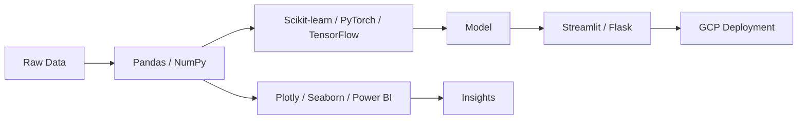

<picture>
  <source media="(prefers-color-scheme: dark)" srcset="https://raw.githubusercontent.com/Mister2005/Mister2005/main/assets/portrait-dark.svg">
  <source media="(prefers-color-scheme: light)" srcset="https://raw.githubusercontent.com/Mister2005/Mister2005/main/assets/portrait-light.svg">
  
</picture>

---

<h1 align="center">Hi, I'm Varun Gupta</h1>

<b>AI & Data Science Enthusiast · Engineering Student · Curious Explorer</b>

**Model Card `varun-gupta-2005`** — Human · AI & Data Science Engineering, Dwarkadas J Sanghvi College of Engineering, Mumbai · CGPA 8.83/10.0 · 2023–2027 · building ML pipelines, agentic systems, and Large Action Models · open to internships and interesting problems.

---

## Projects

### 🧠 [Agentic Alpha: Epistemic Debate Engine](https://github.com/Mister2005/Agentic-Alpha)
A multi-agent framework where AI agents, each locked to a distinct financial theory, debate equities and macro questions through structured adversarial argument. An impartial LLM judge scores each agent's logic and adjusts its credibility live; a synthesis agent turns the surviving arguments into one high-confidence call. Built to fight LLM mode-collapse by forcing theories to fight it out instead of averaging into mush.

### 📱 [On-Device KYC Pipeline](https://github.com/Mister2005/ondevice-kyc)
An end-to-end identity verification pipeline that runs entirely on-device via TensorFlow Lite — face match, liveness detection, document validity, and tamper signals, with no image or biometric data ever leaving the phone. Verified end-to-end on a real device against a real ID and a real live selfie.

### 🛡️ [Handcuff — an antivirus for AI agents](https://github.com/Mister2005/Handcuff)
Security-first observability and enforcement for AI agents: a tamper-evident log of everything an agent actually does at the OS level (processes, files, network), a detonate-and-verdict sandbox, a Windows kernel driver enforcing blocks in Ring-0, and a prompt-injection circuit breaker with content-hash defense against copy/rename evasion.

### 📊 [InvestGuard — Agentic Investment Data Quality System](https://github.com/Mister2005/InvestGuard)
End-to-end data quality intelligence for investment teams: 3-layer anomaly detection, LLM-powered agentic triage, and a real-time dashboard across 6 financial domains — replacing manual reconciliation checks with an autonomous pipeline.

---

## Live Activity

<picture>
  <source media="(prefers-color-scheme: dark)" srcset="https://raw.githubusercontent.com/Mister2005/Mister2005/main/assets/activity-dark.svg">
  <source media="(prefers-color-scheme: light)" srcset="https://raw.githubusercontent.com/Mister2005/Mister2005/main/assets/activity-light.svg">
  
</picture>

Self-hosted, pulled from the real GitHub API, refreshed daily by <a href=".github/workflows/refresh-readme.yml">GitHub Actions</a> — no third-party badge service to go down.

🛠️ Architecture & full skill set

 

  

**Languages:** Python · SQL · Java
**ML/DS:** TensorFlow · PyTorch · Scikit-learn · Pandas · NumPy · Matplotlib
**Visualization:** Seaborn · Plotly · Power BI
**Databases:** MySQL · MongoDB
**Tools & Cloud:** Git · GitHub Actions · Streamlit · Flask · Google Cloud

🎓 Education & achievements

 

**Bachelor of Technology in Artificial Intelligence & Data Science**
Dwarkadas J Sanghvi College of Engineering, Mumbai · CGPA 8.83/10.0 · 2023–2027

- 4x Hackathon Winner
- Mastered Advanced Machine Learning by Kaggle
- Data Analysis certification by FreeCodeCamp
- Top 10 finalist in 2 out of 6 hackathons, earning recognition for "Most Innovative Solution"
- Runner-up in SVKM's MPSTME Technology Innovation Challenge (50+ competing teams)
- 500+ rating on CodeForces; solved 50+ algorithmic challenges
- Led Data Science mentorship program for 200+ undergraduate students

🎵 Limitations, biases & what I'm vibing to

 

- Overfits to caffeine; performance degrades sharply without it
- Known to hallucinate optimism about deadlines
- Currently training on Advanced Deep Learning, LLMs, and Cloud AI Solutions

<table width="100%">
  <tr>
    <td width="50%">
      <a href="https://open.spotify.com/track/20slSXvCF6j6Zp3WMqmyfQ" target="_blank">
        
        
<b>Vartamaan</b> <i>Artist: Ritviz</i>

      </a>
    </td>
    <td width="50%">
      

        
      

    </td>
  </tr>
</table>

---

**Reach me:** [LinkedIn](https://www.linkedin.com/in/varun-yogesh-gupta) · [Email](mailto:varunygupta123@gmail.com) · [Medium](https://medium.com/@varungupta2005)

  

<i>"Striving to make data work for a better, smarter world."</i>

⭐️ From <a href="https://github.com/Mister2005">Varun Gupta</a>

